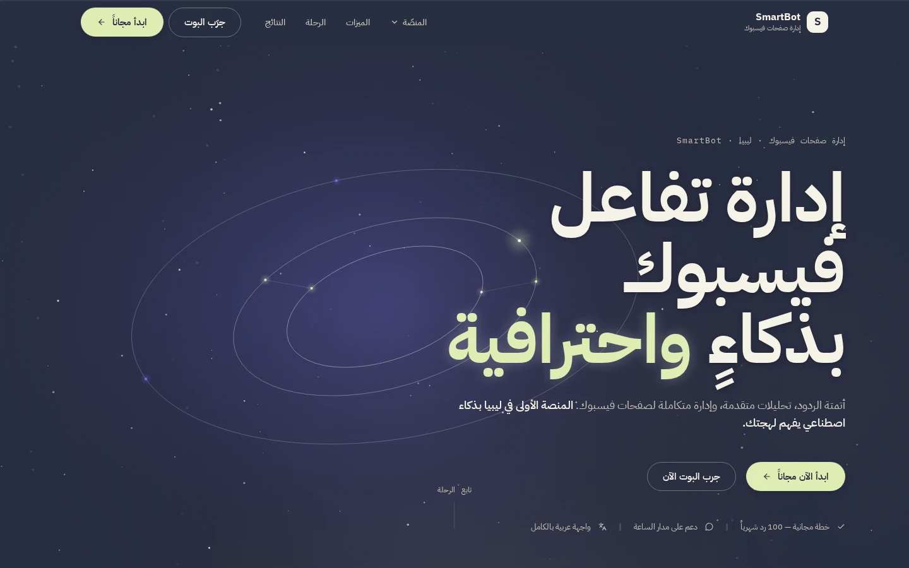
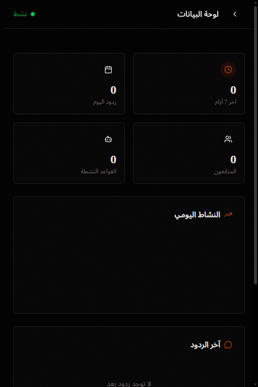
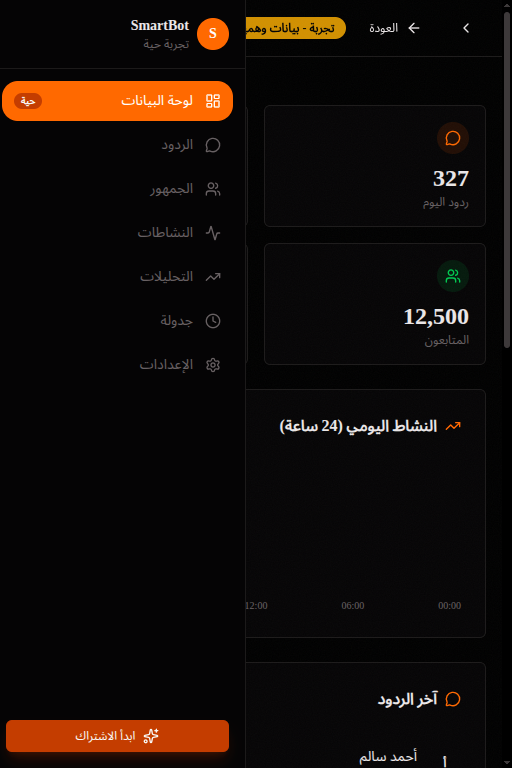
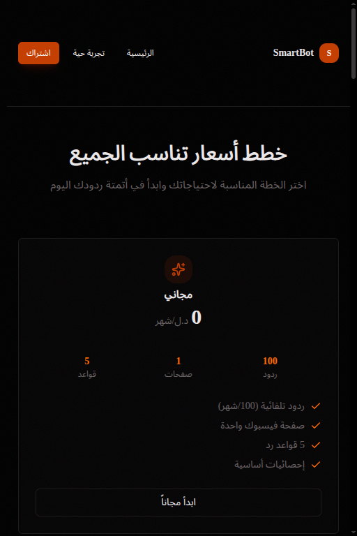
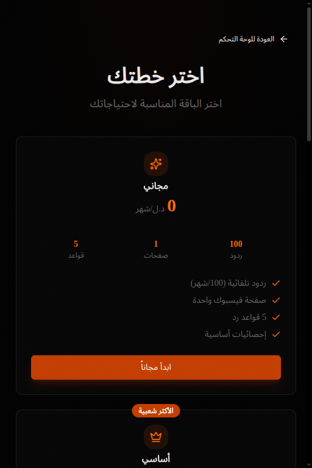
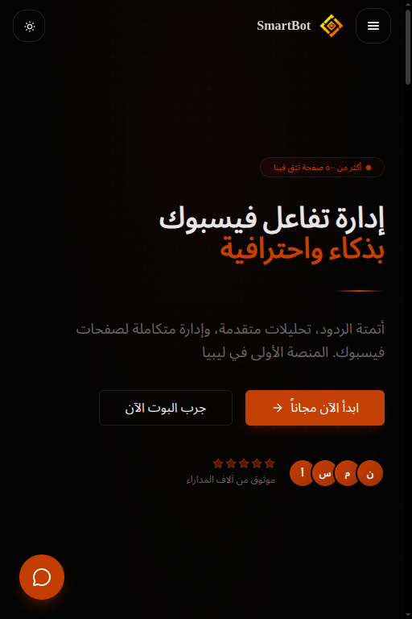
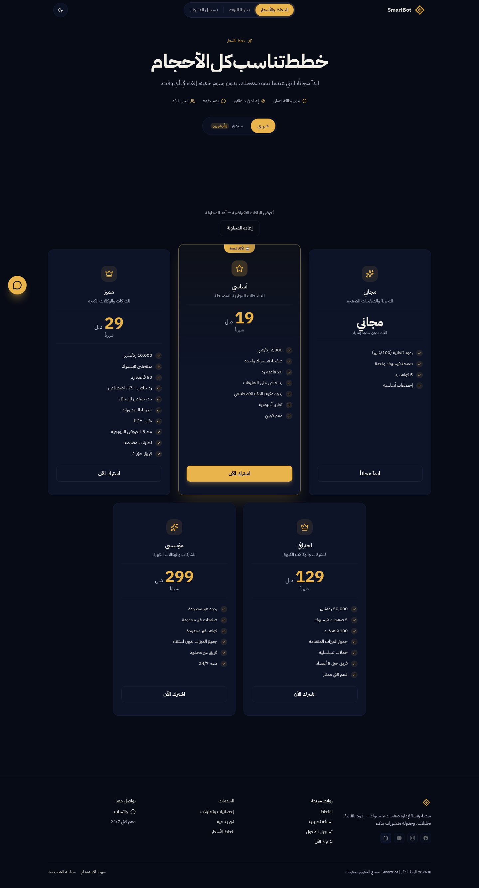

<div align="center">

# 🤖 SmartBot — سمارت بوت

**بوت ماسنجر وأتمتة لصفحات فيسبوك — للسوق الليبي 🇱🇾**
**Messenger bot & Facebook page automation — built for the Libyan market**

[](https://bot.smart-link.ly)
[](https://api.smart-link.ly/api/health)
[](CHANGELOG.md)
[](LICENSE)

**[🌐 bot.smart-link.ly](https://bot.smart-link.ly)** · [🧪 لوحة تجريبية](https://bot.smart-link.ly/demo) · [📚 التوثيق](docs/INDEX.md) · **العربية** · [English](README.en.md)



</div>

---

## ما هو SmartBot؟

منصة **متعددة المستأجرين** (multi-tenant) لإدارة صفحات فيسبوك: لوحة تحكم عربية RTL + محرك بوت يردّ تلقائيًا على **التعليقات والرسائل الخاصة**، ويبثّ رسائل جماعية، ويتابع التسويق، ويحصّن الاشتراكات بمدفوعات ليبية — مع موافقات فورية عبر تيليجرام. SmartBot فرد في منظومة **مدارك / سمارت لينك** (انظر التذييل أسفل الصفحة).

## ✨ المزايا

| المجال | ما تحصل عليه |
|---|---|
| 🚀 **معالج التهيئة** | معالج تهيئة أولى (Onboarding wizard) يقودك خطوة بخطوة من أول دخول — `src/app/onboarding` |
| 🔗 **صفحة الربط** | صفحة Connect لربط صفحات فيسبوك؛ توكنات كل مستأجر **مشفّرة (FERNET)** ومعزولة عن بعضها |
| 💬 **ردود تلقائية** | على التعليقات والرسائل الخاصة عبر محرك تدفقات متعدد المنصات (`flow_engine.py`: ماسنجر أساسًا، مع دعم إنستغرام/واتساب) |
| 📣 **بثّ وتسويق** | رسائل جماعية (Broadcasts) للمشتركين وجداول محتوى وتسويق بالردود |
| 👥 **جداول العملاء والمنشورات** | جدول **العملاء المحتملين** (`dashboard/leads`) وجدول **المنشورات/الإعلانات** (`Post`/`ScheduledPost`/`AdAccount`) وإدارة مشتركين كاملة (CRM) |
| 📊 **لوحة تحكم وتحليلات** | لوحة بيانات برسوم وإحصاءات لحركة الصفحة والرسائل — `dashboard/` |
| 💳 **مدفوعات ليبية** | محافظ **ليبيانا/مدار** + تحويل بنكي، مع **موافقات تيليجرام** وإدارة المدفوعات من لوحة الأدمن |
| 🧾 **تقارير PDF** | تقارير بخط IBM Plex Sans Arabic المرفق — `pdf_reports_engine.py` |
| 📱 **تطبيق جوال أصلي** | Expo + React Native — تنقّل أصلي لا WebView (`mobile/`) |
| 🌓 **هوية مدارك** | ثيم ليلي night/gold ونهاري cream/copper، RTL كامل، تباين AA مقاس رياضيًا |

## 📸 لقطات الشاشة

كل اللقطات التالية من **الإنتاج المباشر** (`bot.smart-link.ly`) — انقر أي لقطة لعرضها بالحجم الكامل:

<table>
  <tr>
    <td width="50%" align="center"><b>لوحة البيانات — <code>/dashboard</code></b><br>
      <a href="docs/screenshots/03-dashboard.png"></a></td>
    <td width="50%" align="center"><b>لوحة التحكم التجريبية — <code>/demo</code></b><br>
      <a href="docs/screenshots/05-demo.png"></a></td>
  </tr>
  <tr>
    <td width="50%" align="center"><b>الخطط والأسعار — <code>/pricing</code></b><br>
      <a href="docs/screenshots/06-pricing.png"></a></td>
    <td width="50%" align="center"><b>الاشتراك — <code>/subscribe</code></b><br>
      <a href="docs/screenshots/07-subscribe.png"></a></td>
  </tr>
  <tr>
    <td width="50%" align="center"><b>صفحة الهبوط (عرض ضيق)</b><br>
      <a href="docs/screenshots/01-landing.png"></a></td>
    <td width="50%" align="center"><b>الأسعار كاملة (سطح المكتب)</b><br>
      <a href="docs/screenshots/09-pricing-desktop.png"></a></td>
  </tr>
</table>

→ التعليقات الكاملة ثنائية اللغة في [docs/screenshots/CAPTIONS.md](docs/screenshots/CAPTIONS.md).

## 🧱 المكدّس التقني

| الطبقة | التقنية |
|---|---|
| الخلفية | **FastAPI** (Python 3.12) — `fb_dashboard/` (routers + engines + bot) |
| الواجهة | **Next.js 16** (App Router، RTL عربية) — `fb_dashboard/frontend/` |
| قاعدة البيانات | SQLAlchemy + Alembic — **Neon PostgreSQL** (إنتاج) / SQLite (تطوير، قاعدة معزولة إجبارية في الاختبارات) |
| الجوال | **Expo + React Native** — `mobile/` (تطبيق أصلي) |
| الاستضافة | Vercel — واجهة [bot.smart-link.ly](https://bot.smart-link.ly) + API [api.smart-link.ly](https://api.smart-link.ly) |
| المراقبة | Sentry/GlitchTip + تنبيهات تيليجرام الحرجة |
| التصميم | هوية **مدارك**: ليلي night/gold `#070B16`/`#E9B44C` — نهاري cream/copper `#FBFAF9`/`#B57438` — خط IBM Plex Sans Arabic. المرجع: `design-system/smartbot/MASTER.md` |

## 🚀 التشغيل محليًا

```bash
python -m venv .venv && .venv/bin/pip install -r requirements.txt
cp .env.example .env                          # الإعدادات الافتراضية للتطوير جاهزة (DEBUG=true)
.venv/bin/python -m uvicorn runner:app --app-dir fb_dashboard --port 8000   # الخلفية على :8000

cd fb_dashboard/frontend
npm install
LOCAL_API_PROXY=http://127.0.0.1:8000 npm run dev   # الواجهة على :3000 مع توكيل /api للخلفية
```

> **ملاحظة الوكيل (v10-H3):** توكيل `/api` في التطوير المحلي يتطلب `LOCAL_API_PROXY` (يعكس توكيل vercel.json في الإنتاج) — بدونه ستردّ نداءات الواجهة 404.

### متغيرات البيئة المطلوبة في الإنتاج

| المتغير | الغرض | توليده |
|---|---|---|
| `SECRET_KEY` | توقيع JWT | `python -c "import secrets; print(secrets.token_urlsafe(32))"` |
| `FERNET_KEY` | تشفير توكنات فيسبوك وأسرار 2FA | `python -c "from cryptography.fernet import Fernet; print(Fernet.generate_key())"` |
| `CRON_SECRET` | حماية نقاط cron (vercel.json) | سر عشوائي قوي |
| `FB_WEBHOOK_VERIFY_TOKEN` | تحقق `GET /webhook` | يطابق إعداد تطبيق فيسبوك |
| `FACEBOOK_APP_SECRET` | تحقق `X-Hub-Signature-256` | من لوحة تطبيق فيسبوك |
| `DATABASE_URL` | PostgreSQL (Neon) | فارغة محليًا = SQLite تلقائي |

> القائمة الكاملة موثقة بالعربية سطرًا بسطر في [`.env.example`](.env.example).

## 🗂️ بنية المشروع

```text
api/index.py                ← نقطة دخول Vercel للـ API (serverless)
fb_dashboard/               ← كود الإنتاج (الخلفية)
├── runner.py               ← تطبيق FastAPI (routers + middleware + lifespan)
├── bot.py                  ← محرك البوت (عزل لكل مستأجر tenant)
├── messenger_service.py    ← خط رسائل الماسنجر (webhook → تخزين → رد)
├── engines (analytics/inbox/subscriber/…)  ← منطق الأعمال
├── routers/                ← مسارات API (كل مسار يرجع {success, data})
├── frontend/               ← واجهة Next.js 16 (App Router, RTL عربية)
├── static/                 ← بناء Next.js المُصدَّر — مُولَّد محليًا، غير متتبَّع في git
├── models.py               ← نماذج SQLAlchemy
└── migrations/             ← ترحيلات SQL التاريخية (001–002)
mobile/                     ← تطبيق الجوال (Expo + React Native) — انظر mobile/README.md
alembic/versions/           ← ترحيلات Alembic (حتى 017)
tests/                      ← اختبارات pytest (1118+ — ترتفع كل جولة، انظر CHANGELOG.md)
e2e/  (frontend/e2e/)       ← بطارية محاكاة Playwright (شخصيات p01–p15)
scripts/                    ← بوابات وفحوص (gate_all.sh، فحص توكنز CSS…)
docs/                       ← التوثيق المنظَّم — docs/INDEX.md (اللقطات في docs/screenshots/)
```

## ⚙️ أوامر التطوير

| الأمر | الوصف |
|---|---|
| `.venv/bin/python -m uvicorn runner:app --app-dir fb_dashboard --port 8000` | تشغيل الخلفية على `:8000` |
| `LOCAL_API_PROXY=http://127.0.0.1:8000 npm run dev` (داخل `fb_dashboard/frontend`) | واجهة Next.js على `:3000` مع توكيل `/api` |
| `cd fb_dashboard/frontend && npm run test:unit` | اختبارات الواجهة (vitest) |
| `cd fb_dashboard/frontend && npm run typecheck` | فحص TypeScript |
| `bash scripts/gate_all.sh` | كل بوابات الجودة دفعة واحدة |

## 🛡️ بوابات الجودة

تعمل آليًا على كل push/PR عبر GitHub Actions (Node 24):

| البوابة | الأمر | التوقع |
|---|---|---|
| Lint | `ruff check fb_dashboard api tests scripts` | صفر ملاحظة |
| اختبارات الخلفية | `.venv/bin/python -m pytest -q` | **1118+ passed** — ترتفع كل جولة (انظر CHANGELOG.md) |
| TypeScript | `cd fb_dashboard/frontend && npm run typecheck` | 0 خطأ |
| اختبارات الواجهة | `cd fb_dashboard/frontend && npx vitest run` | خضراء — ترتفع كل جولة |
| بناء الإنتاج | `npm run build` | ينجح قبل الدمج |
| i18n موحّد | `python scripts/check_i18n_calls.py` | صفر استدعاء `toLocale` خارج format.ts |
| تسميات وصولية | `node scripts/check_a11y_labels.ts` | صفر عنصر أيقونة-فقط بلا اسم |
| تباين AA | `node scripts/check_contrast.mjs` | كل التوليفات ≥ 4.5:1 (مقاسة رياضيًا) |

> حتمية الاختبارات: `conftest.py` في الجذر **يفرض** قاعدة SQLite مؤقتة معزولة — لا ترث `DATABASE_URL` من الجهاز أبدًا.

## 📈 المراقبة وتتبع الأخطاء

- `GET /api/health` — liveness (لا يلمس القاعدة) · `GET /api/health/ready` — readiness مع `latency_ms`.
- كل استجابة تحمل `X-Request-Id` يظهر في سطر السجل (`rid=…`).
- **Sentry/GlitchTip مفعّل افتراضيًا** (DSN عام للإرسال فقط؛ للتعطيل: `SENTRY_DSN=off`)، وكل 500 غير معالج يصل الأدمن عبر تيليجرام فورًا مع تبريد 5 دقائق لكل بصمة خطأ، وكشف توقف الكرون (>15 دقيقة بدون نبض).

## 🚢 النشر

مشروعا Vercel (التفاصيل في [docs/deployment.md](docs/deployment.md)):

- **API** (`vercel.json`): FastAPI serverless — `api/index.py` → **api.smart-link.ly**
- **الواجهة** (`fb_dashboard/frontend/vercel.json`): Next.js → **bot.smart-link.ly**
- الترحيلات: `alembic upgrade head` عند تغيّر المخطط (أحدث ترحيل 017).

## 📚 التوثيق وسياسة الفروع

- خريطة التوثيق الكاملة: **[docs/INDEX.md](docs/INDEX.md)** — دليل المستخدم العربي، البنية، النشر، قرارات التصميم.
- الفروع: `main` محمي بقواعد GitHub ([docs/branch-protection.md](docs/branch-protection.md))، و`develop` للدمج `--no-ff` بعد إغلاق بوابات الخروج.

---

## 🛰️ جزء من منظومة مدارك — Part of the Madarek Ecosystem

> نظام تصميم واحد لكل المشاريع · هوية مدارك: ليلي night/gold `#070B16`/`#E9B44C` — نهاري cream/copper `#FBFAF9`/`#B57438` — خط IBM Plex Sans Arabic

| المشروع | الدور | GitHub | الموقع المباشر |
|---|---|---|---|
| 🎓 **مدارك / Madarek** | منصة التعليم الذكي لجامعة الزاوية — المرجع الأم لنظام التصميم | [github.com/ahmadmedo1012/madarek](https://github.com/ahmadmedo1012/madarek) | [madarek.onrender.com](https://madarek.onrender.com) |
| 🔗 **سمارت لينك / Smart-Link** | المظلة الرقمية للأعمال في ليبيا | [github.com/ahmadmedo1012/Smart-Link](https://github.com/ahmadmedo1012/Smart-Link) | [smart-link.ly](https://smart-link.ly) |
| 🍽️ **سمارت منيو / Smart-Menu** | منيو رقمي وطلبات واتساب للمطاعم | [github.com/ahmadmedo1012/Smart-Menu](https://github.com/ahmadmedo1012/Smart-Menu) | [menu.smart-link.ly](https://menu.smart-link.ly) |
| 🤖 **سمارت بوت / SmartBot** | بوت ماسنجر وأتمتة لصفحات فيسبوك | [github.com/ahmadmedo1012/SmartBot](https://github.com/ahmadmedo1012/SmartBot) | [bot.smart-link.ly](https://bot.smart-link.ly) |
| 🛍️ **سمارت أوردر / Smart-Order** | متجر رقمي وطلبات وتوصيل للأعمال | [github.com/ahmadmedo1012/Smart-Order](https://github.com/ahmadmedo1012/Smart-Order) | [order.smart-link.ly](https://order.smart-link.ly) |

## 📄 الرخصة

هذا المشروع برخصة **ملكية خاصة (Proprietary)** — جميع الحقوق محفوظة © 2026 أحمد مدو (ahmadmedo1012). لا يُمنح أي حق في الاستخدام أو النسخ أو التعديل أو النشر أو التوزيع أو التشغيل دون إذن كتابي مسبق من مالك الحقوق. النسخ أو التفرّع أو المشاهدة لا يمنح أي حق في البناء أو التشغيل أو إعادة التوزيع. التفاصيل الكاملة في ملف [LICENSE](LICENSE).
